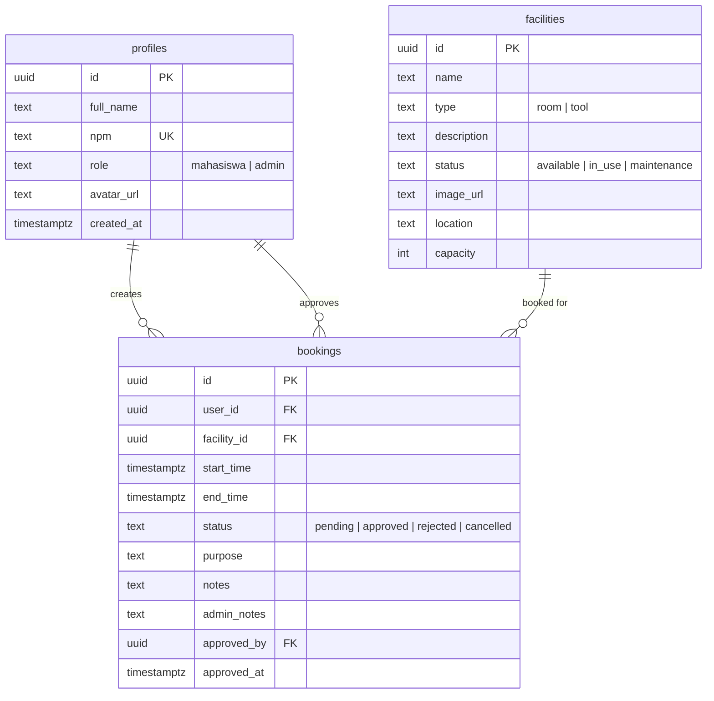
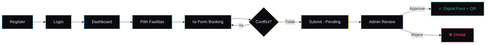

<div align="center">

# ⬡ HIMSI Book

### 🏛️ Sistem Booking Fasilitas Kampus Digital

<br/>

[](https://nextjs.org/)
[](https://typescriptlang.org/)
[](https://tailwindcss.com/)
[](https://supabase.com/)
[](https://www.framer.com/motion/)

<br/>

<p align="center">
  <samp>
    Mendigitalisasi proses peminjaman ruangan & peralatan kampus<br/>
    untuk organisasi mahasiswa <b>HIMSI</b> (Himpunan Mahasiswa Sistem Informasi)
  </samp>
</p>

<br/>

---

<br/>

<kbd> <a href="#-fitur-utama">Fitur</a> </kbd>&nbsp;&nbsp;
<kbd> <a href="#%EF%B8%8F-tech-stack">Tech Stack</a> </kbd>&nbsp;&nbsp;
<kbd> <a href="#-arsitektur">Arsitektur</a> </kbd>&nbsp;&nbsp;
<kbd> <a href="#-getting-started">Setup</a> </kbd>&nbsp;&nbsp;
<kbd> <a href="#-database-schema">Database</a> </kbd>&nbsp;&nbsp;
<kbd> <a href="#-kontribusi">Kontribusi</a> </kbd>

<br/><br/>

</div>

## ✨ Masalah yang Diselesaikan

<table>
<tr>
<td width="50%">

### ❌ Sebelum (Manual)
- Booking via chat/kertas
- Jadwal sering bentrok
- Tidak ada tracking status
- Admin kewalahan mengelola
- Tidak ada bukti peminjaman

</td>
<td width="50%">

### ✅ Sesudah (HIMSI Book)
- Booking digital real-time
- **Conflict detection** otomatis
- Status tracking (pending → approved)
- Dashboard admin terintegrasi
- **Digital Pass** dengan QR Code

</td>
</tr>
</table>

<br/>

## 🎯 Fitur Utama

<div align="center">

|  | Fitur | Deskripsi |
|:-:|:--|:--|
| 🔐 | **Auth System** | Login/Register dengan Supabase Auth + Role-based access (Mahasiswa & Admin) |
| 📊 | **Bento Grid Dashboard** | Ringkasan real-time: stat cards, status fasilitas, booking terbaru |
| 📅 | **Weekly Calendar** | Kalender mingguan interaktif — lihat slot kosong per fasilitas |
| ⚡ | **Conflict Detection** | Validasi otomatis mencegah jadwal bentrok sebelum submit |
| ✅ | **Admin Approval** | Workflow persetujuan real-time: approve/reject dengan satu klik |
| 🎫 | **Digital Pass** | Kartu pinjam digital + QR Code setelah booking disetujui |
| 🔄 | **Realtime Updates** | Status booking terupdate otomatis via Supabase Realtime |
| 📱 | **Responsive** | Sempurna di desktop & mobile dengan slide-out navigation |

</div>

<br/>

## 🛠️ Tech Stack

<div align="center">

```
┌─────────────────────────────────────────────────────────────┐
│                                                             │
│   Frontend          Backend           Extras                │
│   ─────────         ──────            ──────                │
│   ▸ Next.js 16      ▸ Supabase        ▸ Framer Motion      │
│   ▸ React 19        ▸ PostgreSQL      ▸ qrcode.react       │
│   ▸ TypeScript 5    ▸ Row Level       ▸ date-fns           │
│   ▸ Tailwind v4       Security        ▸ Lucide Icons       │
│                     ▸ Realtime                              │
│                                                             │
│   Design                                                    │
│   ──────                                                    │
│   ▸ Dark Mode       ▸ Glassmorphism   ▸ Glow Effects       │
│   ▸ Inter + JetBrains Mono           ▸ Spring Animations   │
│                                                             │
└─────────────────────────────────────────────────────────────┘
```

</div>

<br/>

## 🏗 Arsitektur

```
src/
├── app/
│   ├── (auth)/                    # 🔐 Login & Register
│   │   ├── login/page.tsx
│   │   └── register/page.tsx
│   ├── (dashboard)/               # 📊 User Pages
│   │   ├── dashboard/page.tsx     #    Bento Grid Dashboard
│   │   ├── booking/               #    Booking System
│   │   │   ├── page.tsx           #    Weekly Calendar
│   │   │   └── new/page.tsx       #    New Booking Form
│   │   ├── my-bookings/page.tsx   #    Booking History
│   │   ├── facilities/page.tsx    #    Facility Catalog
│   │   └── digital-pass/[id]/    #    🎫 QR Digital Pass
│   ├── (admin)/                   # 🛡️ Admin Pages
│   │   ├── admin/page.tsx         #    Admin Dashboard
│   │   ├── admin/approvals/       #    Approval Queue
│   │   └── admin/facilities/      #    CRUD Facilities
│   ├── globals.css                # 🎨 Design System
│   ├── layout.tsx                 # Root Layout
│   └── template.tsx               # Page Transitions
│
├── components/
│   ├── ui/                        # 🧱 Primitives (Button, Card, Modal, ...)
│   ├── layout/                    # 📐 Sidebar, Topbar, MobileNav
│   ├── dashboard/                 # 📊 BentoGrid, StatCard
│   ├── booking/                   # 📅 BookingCard, WeeklyCalendar
│   └── digital-pass/              # 🎫 DigitalPassCard + QR
│
├── lib/
│   ├── supabase/                  # 🔌 Client & Server instances
│   ├── utils/                     # 🔧 conflictCheck, dateHelpers, cn
│   └── types/                     # 📝 Database TypeScript types
│
├── hooks/                         # 🪝 useAuth, useRealtime
└── middleware.ts                   # 🛡️ Auth guard + Role check
```

<br/>

## 🚀 Getting Started

### Prerequisites

- **Node.js** 18+
- **npm** 9+
- Akun [Supabase](https://supabase.com) (gratis)

### 1. Clone & Install

```bash
git clone https://github.com/Afta20/Booking-system.git
cd Booking-system
npm install
```

### 2. Setup Supabase

```bash
# Copy environment template
cp .env.local.example .env.local
```

Edit `.env.local` dengan credentials dari Supabase Dashboard → Settings → API:

```env
NEXT_PUBLIC_SUPABASE_URL=https://your-project.supabase.co
NEXT_PUBLIC_SUPABASE_ANON_KEY=your-anon-key-here
```

### 3. Setup Database

Buka **Supabase Dashboard → SQL Editor** → New Query → paste isi file [`supabase/schema.sql`](supabase/schema.sql) → **Run**

Ini akan membuat:
- ✅ Tabel `profiles`, `facilities`, `bookings`
- ✅ Row Level Security policies
- ✅ Auto-profile trigger saat register
- ✅ Conflict check function
- ✅ Realtime subscriptions
- ✅ 8 fasilitas sample (seed data)

### 4. Run Development Server

```bash
npm run dev
```

Buka **[http://localhost:3000](http://localhost:3000)** 🎉

### 5. Create Admin User

1. Register akun baru di app
2. Buka Supabase → Table Editor → `profiles`
3. Ubah `role` ke `admin`
4. Refresh app — menu admin muncul!

<br/>

## 🗄 Database Schema



<br/>

## 🎨 Design Philosophy

<div align="center">

| Aspek | Implementasi |
|:---:|:---|
| 🌑 | **Dark Mode** — Near-black backgrounds (#0a0a0f) for reduced eye strain |
| 💎 | **Glassmorphism** — `backdrop-blur` + semi-transparent layers + subtle borders |
| ✨ | **Glow Effects** — Accent-colored box shadows activated on hover |
| 🎯 | **Electric Blue** `#00D4FF` — Primary accent for actions & focus states |
| 🟢 | **Emerald Green** `#10B981` — Success states & secondary accent |
| 🔤 | **Inter + JetBrains Mono** — Modern sans-serif + monospace for data |
| 🎬 | **Spring Physics** — Framer Motion spring animations on all interactive elements |

</div>

<br/>

## 📱 User Flow



<br/>

## 🔒 Security

- **Row Level Security (RLS)** — Setiap tabel dilindungi policies
- **Server-side validation** — Conflict check di database level
- **Cookie-based sessions** — `@supabase/ssr` untuk auth yang aman
- **Middleware protection** — Route guard + admin role check
- **Environment variables** — Credentials tidak pernah di-commit

<br/>

## 🤝 Kontribusi

Contributions welcome! Silakan fork dan buat pull request.

```bash
# Fork → Clone → Branch → Code → Push → PR
git checkout -b feature/fitur-baru
git commit -m "feat: tambah fitur baru"
git push origin feature/fitur-baru
```

<br/>

## 📄 Lisensi

Dibuat dengan ❤️ untuk **HIMSI** — Himpunan Mahasiswa Sistem Informasi

<br/>

---

<div align="center">

<br/>

**⬡ HIMSI Book** — *Booking fasilitas kampus, tanpa drama jadwal bentrok.*

<br/>

[](https://vercel.com/new/clone?repository-url=https://github.com/Afta20/Booking-system)

<br/>

<sub>Built with Next.js 16 · React 19 · Tailwind v4 · Supabase · Framer Motion</sub>

</div>
